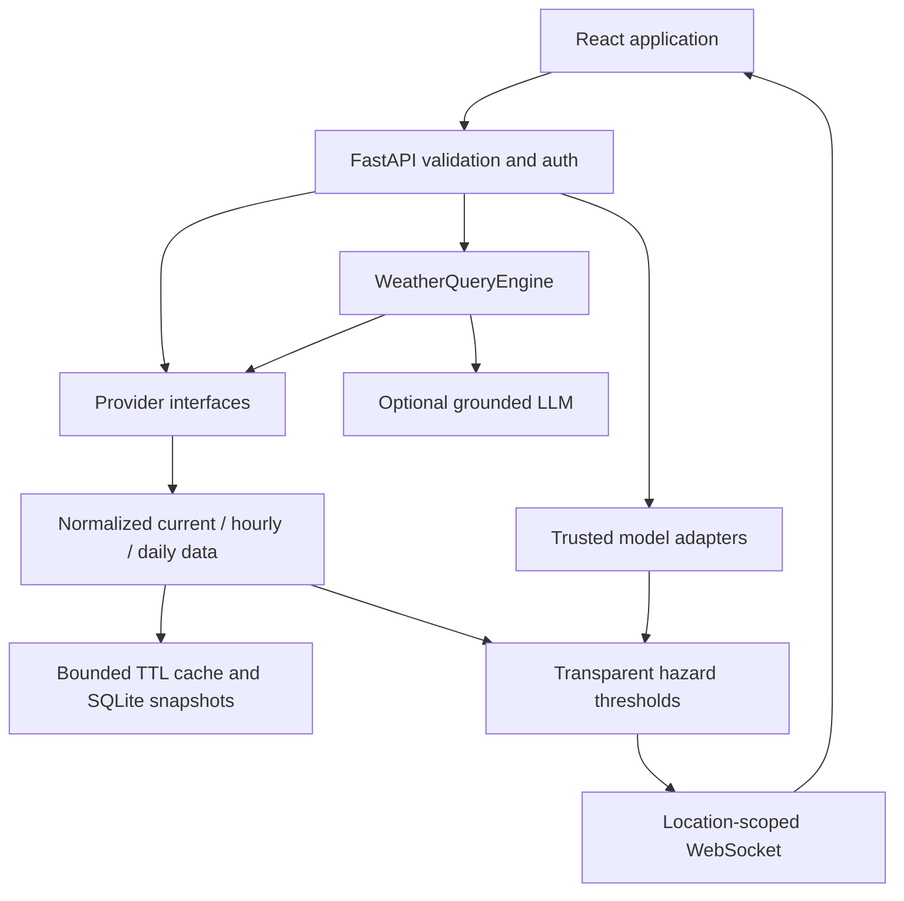

# WeatherGPT architecture

WeatherGPT is a local-first FastAPI application with a React/TypeScript SPA. The initial Sites scaffold is retained, but Vite builds static assets for FastAPI rather than a hosted Worker. Python owns identity, data and WebSockets. No external account or API key is required for the default weather path.

## Frontend

The application uses shared location, weather, identity, language and appearance state. Routes load lazily. Recharts provides interactive forecast and archive plots; Three.js renders Earth with locally stored Natural Earth polygons. Browser geolocation and speech recognition are feature-detected. Markdown rendering excludes raw HTML. Component primitives come from the generated Shadcn/Base UI catalog.

Local storage contains device preferences and local chat history, never auth tokens. The server's session cookie is HttpOnly. Signed-in conversations are stored with user ownership and isolated by database queries.

## Weather and GIS

`backend/providers/weather.py` contains the provider protocol, Open-Meteo adapter, retrying HTTP client, a bounded cache, and USGS normalization. Current conditions are numerical model estimates, not station observations. Every response includes status and source. Provider failures yield unavailable data, not invented weather.

The globe requests 25 regional samples at 3° spacing around the selection. Wind speed/direction become eastward and northward components in m/s. The renderer inverse-distance interpolates the four nearest samples and advects a fixed particle population. Visual time is accelerated and is not physical playback. Temperature, rain, humidity, pressure and cloud layers render colored regional samples. The globe does not claim global radar coverage. Earthquake markers are actual USGS reports, sized by magnitude.

Cyclone tracks, official warning polygons, global ocean and air-quality raster layers are integration boundaries. The UI explicitly says when those layers are unavailable. Selected-location air quality and marine series use separate provider endpoints.

## Storage and scheduling

SQLAlchemy uses SQLite by default and creates tables idempotently at startup. `DATABASE_URL` supports replacement by a SQLAlchemy-compatible PostgreSQL connection after installing its driver. PostGIS is not required or implemented.

Tables: `users`, `auth_sessions`, `saved_locations`, `chat_messages`, and indexed `records` for normalized observations and predictions. Location snapshots upsert by rounded coordinate key rather than duplicating observations. This first schema uses `create_all`; existing schema changes require reviewed migrations, not automatic destructive alteration.

An optional background task refreshes at most 50 watched locations every configured interval (minimum 60 seconds) and deletes expired sessions. The single-process deployment maintains its cache, rate limiter, active alerts and subscriptions in memory. Multiple workers require shared cache/pubsub and a single scheduler owner.

## Safety and security boundaries

- Argon2 password hashes; random session tokens stored only as SHA-256 hashes.
- SameSite cookies, same-origin mutation checks, input bounds and rate limits.
- User-scoped data queries and explicit admin role checks.
- Pickle loading disabled by default; explicit trust and feature/preprocessing manifest required.
- No calibrated confidence is invented for rules or uncalibrated models.
- WebSockets reconnect with bounded backoff; notifications require browser consent.
- Offline service worker never caches API data, emergency alerts or authenticated responses.
- Threshold alerts are non-official screening. No alert is not an all-clear.

## Operational limitations

The local launcher serves one process on 127.0.0.1:8000. Production needs HTTPS, secure cookies, a reverse proxy, backups, deployment-specific rate limits, and secrets management. Public emergency delivery requires authoritative feeds and push infrastructure; the current browser notifications work only while the app is open.
